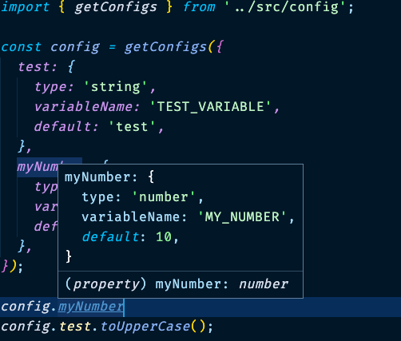

# env-ts-conf

## Typed environment configuration for node

**env-ts-conf** is a simple library that provides types and autocompletion for configuration loaded from environment file.

You start from a configuration object describing the environment variabiles you want to load

```ts
const config = getConfigs({
  test: {
    type: 'string',
    variableName: 'TEST_VARIABLE',
    default: 'test',
  },
  myNumber: {
    type: 'number',
    variableName: 'MY_NUMBER',
    default: 10,
  },
});
```

and you get back a typed object:

```ts
const conf: {
  test: string;
  myNumber: number;
};
```



## Features

- typed configuration and autocompletion!
- crashes if env variable is not found!
